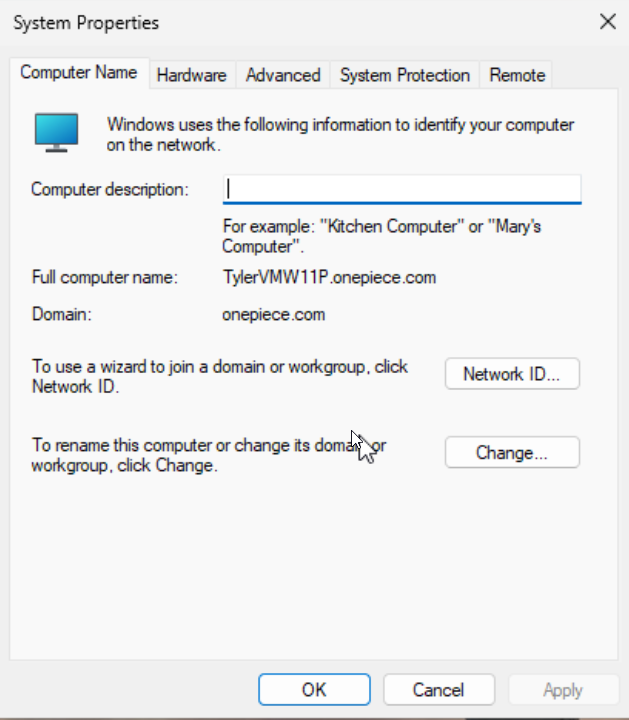

# Cyber Journey (2026)

This repo documents my cybersecurity journey from beginner → job-ready using hands-on labs, weekly writeups, and portfolio projects.

## Current Focus (Week 1)
- Setting up my documentation system (GitHub → DEV.to → LinkedIn)
- Building my Z640 lab (Proxmox + Windows + Linux VMs)
- Active Directory domain + Windows 11 client joined

## DEV.to Series
- From Helpdesk to Cybersecurity (2026)

## Lab Evidence (Week 1)

### Windows 11 joined to domain

### Windows 11 DNS points to Domain Controller

## Projects Index
- (coming soon)

## Weekly Notes Index
- [2026 – Week 01 (Jan 13–Jan 19)](weekly-notes/2026-W01.md)
